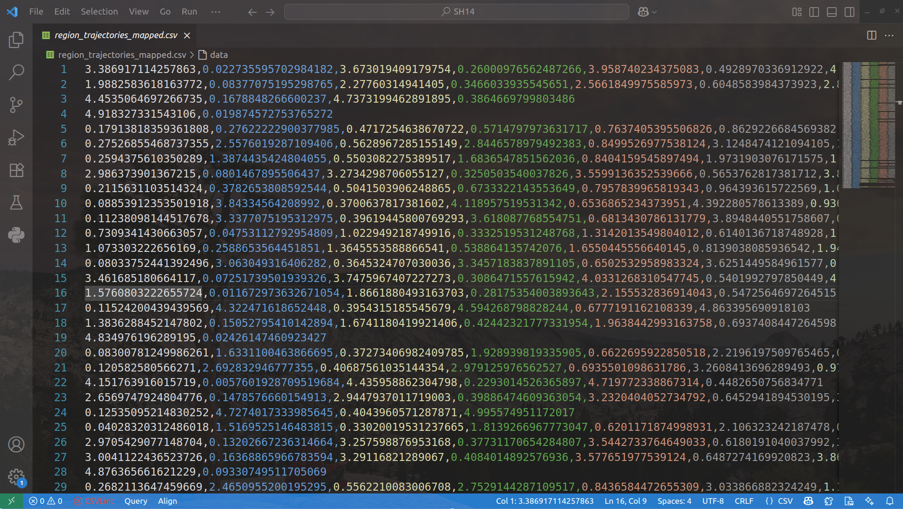

### Ocean-Current-Data-Analysis

------

##### (0) Introduction

As we know, ocean currents are influenced by two main components:

- **Ekman Current**, which is the surface current driven by **wind stress**;
- **Geostrophic Current**, primarily driven by the **sea surface height gradient and balanced Coriolis force**, representing **large-scale, low-frequency variations in ocean circulation**.

The combined effects of these two components on ocean currents can be obtained from the open-source dataset [GlobCurrent v3](ftp://eftp.ifremer.fr/). The latest available dataset file is from May 5, 2016: `20160505000000-GLOBCURRENT-L4-CUReul_15m-ALT_MED_SUM-v03.0-fv01.0.nc`

We will use a Lagrangian simulator called **Parcels** to perform simulations on this dataset.


##### (1) Running `basic_info.py` to Read Basic Information

```bash
<xarray.Dataset>
Dimensions:                                    (time: 1, lat: 128, lon: 344)
Coordinates:
  * time                                       (time) object 2016-05-05 00:00:00
  * lat                                        (lat) float32 30.06 ... 45.94
  * lon                                        (lon) float32 -5.938 ... 36.94
Data variables:
    eastward_eulerian_current_velocity         (time, lat, lon) float32 ...
    northward_eulerian_current_velocity_error  (time, lat, lon) float32 ...
    eastward_eulerian_current_velocity_error   (time, lat, lon) float32 ...
    northward_eulerian_current_velocity        (time, lat, lon) float32 ...
Attributes: (12/56)
    cdm_data_type:                 grid
    time_coverage_resolution:      P3H
    format_version:                GlobCurrent v3.0
    product_version:               1.0
    processing_software:           SURCOUF
    sensor_type:                   
    ...                            ...
    geospatial_lat_resolution:     0.125
    geospatial_lon_resolution:     0.125
    date_created:                  20170106T165602Z
    date_modified:                 20170106T165602Z
    time_coverage_start:           20160505T000000Z
    time_coverage_end:             20160505T000000Z
```

➤ Spatial coverage:

- Latitude (`lat`): from 30.06°N to 45.94°N, covering approximately 15.88°
- Longitude (`lon`): from -5.938°E to 36.94°E, covering approximately 42.88°
- This dataset covers the **Mediterranean Sea and parts of the Eastern Atlantic Ocean**

➤ `eastward_eulerian_current_velocity` and `northward_eulerian_current_velocity`

- Represent the **total current velocity components in Eulerian description**, measured in meters per second (m/s)
- `eastward`: Eastward component (U component)
- `northward`: Northward component (V component)
- Together, they form the **2D horizontal velocity vector field**

➤ `*_error`

- Represent the estimation errors of the above velocity fields, typically caused by interpolation, model uncertainty, or observation errors

➤ Other key information:

- `GlobCurrent v3.0`: a data product supported by ESA (European Space Agency)
- `SURCOUF`: a data fusion software or method that integrates Ekman, geostrophic, and residual currents


##### (2) Simulation Using Parcels

By running `animation.py`, 1000 particles are released and drift within the total current velocity field over 100 days. Their positions are updated every 30 minutes, and their trajectories are recorded hourly and saved to a `*.zarr` file.


##### (3) Visualization

(3.1) Running `process.py` visualizes the zarr file from (2) as a time series. After running for some time, the generated image looks like this:


A zoomed-in view appears as follows:


(3.2) Running `outcome.py` directly plots the ocean current data based on the zarr file generated in step (2).

(3.3) Running `main.py` randomly selects an available area, completes coordinate mapping (for non-geographic systems like Cartesian coordinates), and saves the mapped trajectory points as a `*.csv` file for further experiments.


##### (4) Notes and Future Improvements

Due to the dataset’s non-uniformity and disconnected regions, we currently define an available area as one that meets the following conditions (subject to change):

- Latitude and longitude differences both equal `0.1°`, falling within `30°~45°N` and `15~36°E`
- Contains between 800 and 1500 data points
- Contains at least 60 trajectories

Based on these assumptions, we propose a **target control logic**: after selecting a valid region, all trajectory points within it are mapped to a designated area. The target motion follows the ocean current trajectories (thus, start points are discretely placed along the edges to simplify modeling).

An example of the mapped available region's trajectory point set and trajectory diagram is shown below:

<div style="display: flex; justify-content: center; gap: 10px;">
    
    
</div>

This approach allows us to verify the robustness of subsequent algorithms across different regions while also demonstrating the practical feasibility of the method.