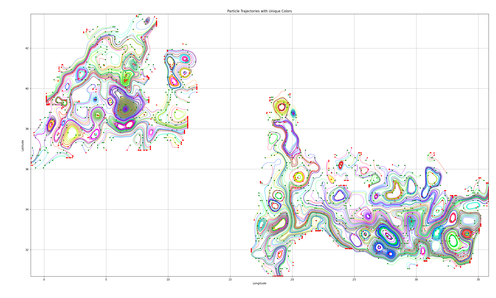
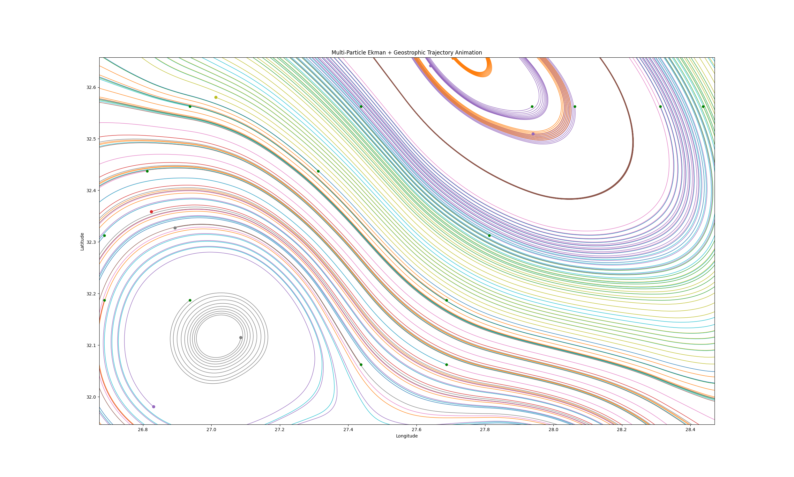
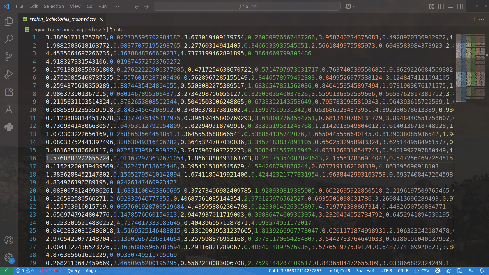
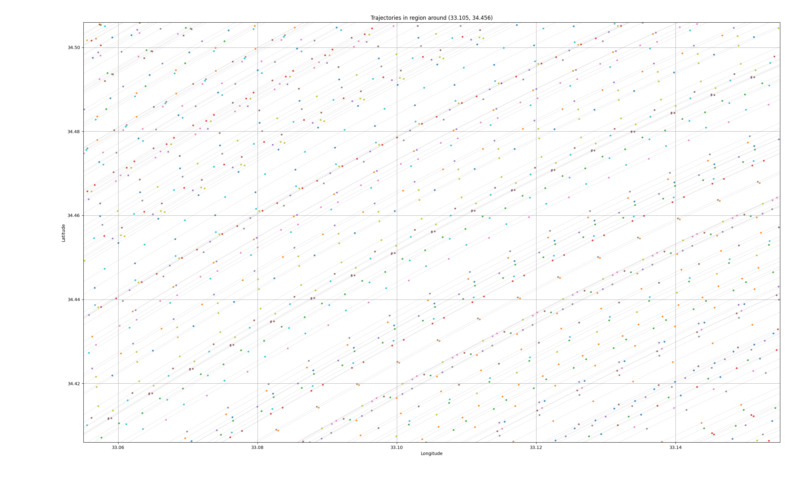

### Ocean-Current-Data-Analysis

---

##### （0）写在前面

我们知道，洋流运受到两部分的影响：其一是 **Ekman Current**，是由**风应力**驱动产生的表层海流，其二是 **Geostrophic Current**，主要是由**海面高度梯度和平衡科氏力**产生的洋流，反映的是**大尺度、低频变化的海洋环流** 。

由以上两个因素综合影响后的洋流运动数据可从开源数据集 [GlobCurrent v3](ftp://eftp.ifremer.fr/) 中获取，目前能获取的最新数据集文件是 2016 年 5 月 5 日测得的 `20160505000000-GLOBCURRENT-L4-CUReul_15m-ALT_MED_SUM-v03.0-fv01.0.nc` 

我们将使用一种拉格朗日模拟器 —— Parcels 对该数据集进行仿真。


##### （1）运行 `basic_info.py` 可以读取该数据集的基本信息

```bash
<xarray.Dataset>
Dimensions:                                    (time: 1, lat: 128, lon: 344)
Coordinates:
  * time                                       (time) object 2016-05-05 00:00:00
  * lat                                        (lat) float32 30.06 ... 45.94
  * lon                                        (lon) float32 -5.938 ... 36.94
Data variables:
    eastward_eulerian_current_velocity         (time, lat, lon) float32 ...
    northward_eulerian_current_velocity_error  (time, lat, lon) float32 ...
    eastward_eulerian_current_velocity_error   (time, lat, lon) float32 ...
    northward_eulerian_current_velocity        (time, lat, lon) float32 ...
Attributes: (12/56)
    cdm_data_type:                 grid
    time_coverage_resolution:      P3H
    format_version:                GlobCurrent v3.0
    product_version:               1.0
    processing_software:           SURCOUF
    sensor_type:                   
    ...                            ...
    geospatial_lat_resolution:     0.125
    geospatial_lon_resolution:     0.125
    date_created:                  20170106T165602Z
    date_modified:                 20170106T165602Z
    time_coverage_start:           20160505T000000Z
    time_coverage_end:             20160505T000000Z
```

➤ 空间范围：

- 纬度（lat）：30.06°N 到 45.94°N，跨度约 15.88°
- 经度（lon）：-5.938°E 到 36.94°E，跨度约 42.88°
- 这是一个包含**地中海和东大西洋部分区域**的海域

➤ `eastward_eulerian_current_velocity` 和 `northward_eulerian_current_velocity`

- 表示 **欧拉描述下的总流速分量**，单位为 m/s
- `eastward`: 向东（U分量）
- `northward`: 向北（V分量）
- 这两项合起来就是 **二维水平流场矢量**

➤ `*_error`

- 表示上述流速估计的误差值，常来源于插值、模型不确定性或观测误差估算

➤ 其它重要数据：

- `GlobCurrent v3.0`：这是欧空局（ESA）支持的海洋流项目数据产品版本
- `SURCOUF`：是一种数据融合软件或方法，整合 Ekman、地转和残差流速


##### （2）基于 Parcels 完成仿真

运行 `animation.py` 可在该数据集所覆盖区域内生成 1000 个粒子在总流速场中随流漂移 100 天，每 30 分钟计算一次位置，每小时记录一次轨迹，输出到 `*.zarr` 文件中


##### （3）可视化

（3.1）运行 `process.py`，按时序可视化（2）形成的 zarr 文件，运行一段时间后图像如下所示



局部放大后如下图所示



（3.2）运行 `outcome.py`，直接根据（2）形成的 zarr 文件绘制出洋流数据图

（3.3）运行 `main.py`，随机挑选可用区域并完成映射（用于非经纬度度量体系，如笛卡尔坐标系），并将映射后的轨迹点集保存为 `*.csv` 文件，用于后续实验


##### （4）一些说明与改进

鉴于此洋流数据集的非均衡性与非连通性，我们规定可用区域满足以下条件（后续可能改变）：

* 经纬度之差均为 `0.1°`，且落在 `30°~45°N，15~36°E` 范围内
* 区域内存在 800 ～ 1500 个数据点
* 区域内至少存在 60 条轨迹

根据以上调研与假设，我们给出一种**目标控制逻辑**：选定一块可用区域后，将其上的轨迹点全部映射到指定区域上，目标运动轨迹遵循洋流轨迹（借此规定起点在各边上是离散的，降低建模难度）。

一个映射后的可用区域轨迹点集与轨迹图如下所示

<div style="display: flex; justify-content: center; gap: 10px;">
    
    
</div>

如此既可以通过挑选不同区域验证后续算法鲁棒性，也在一定程度上证明该算法实际应用的可行性。

